# Report

## Background
When *Saccharomyces cerevisiae* is exposed to heat stress, it rapidly
reprograms gene expression through the transcription factors Msn2/4 and Hsf1.
Gasch et al. (2000) characterised this response genome-wide, defining the
Environmental Stress Response (ESR): ~900 genes that respond consistently
across diverse stresses. Induced ESR genes include chaperones, trehalose
biosynthesis and oxidative stress defense; repressed genes are dominated by
ribosomal proteins and the translational machinery.

If this signature is robust, a simple heat vs. control comparison should be
enough to recover it. This pipeline tests that hypothesis using six wild-type
RNA-seq samples from Serrano-Quílez et al. (2025) — three at baseline (30°C)
and three after a 20-minute heat shock at 39°C (BioProject PRJNA1159129).

## Methods
Raw paired-end reads were downloaded from SRA using `fasterq-dump` and
quality-trimmed with `fastp` (adapter auto-detection, Q20 minimum quality,
36 bp minimum length). Expression was quantified by quasi-mapping against
the *S. cerevisiae* R64-1-1 reference transcriptome (Ensembl release 115)
using `Salmon` (Patro et al. 2017) with GC- and sequence-bias correction.
Quality metrics were aggregated with `MultiQC` (Ewels et al. 2016).

Transcript-level counts were summarised to gene level via `tximport` and
imported into `DESeq2` (Love et al. 2014) for differential expression
analysis (heat vs. control). Genes with fewer than 10 reads in at least
two samples were excluded. DEGs were defined at two adjusted p-value
thresholds (0.05 and 0.0005) with a minimum |log₂FC| of 1.0 to assess
signal robustness across stringency levels.

GO enrichment was performed using `clusterProfiler` (Wu et al. 2021)
(Biological Process ontology, `org.Sc.sgd.db` ORF keytype,
Benjamini-Hochberg correction). The full pipeline is implemented in
Snakemake and available at github.com/nomis-c/yeast-stress-rnaseq.

## Results

### Quality Control

Raw read quality, trimming efficiency and mapping rates were assessed using
`fastp` and `Salmon`, aggregated with `MultiQC`.

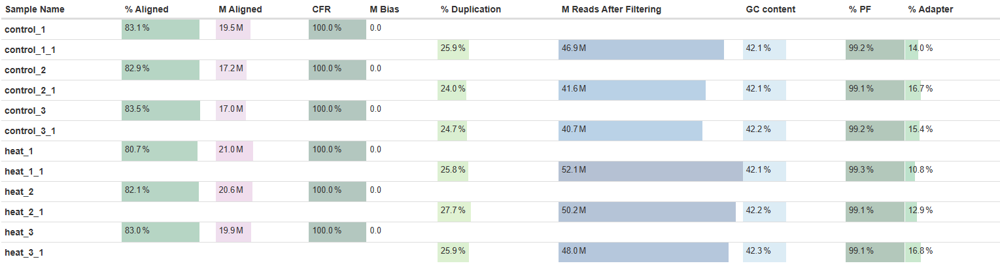

**Figure 1.** MultiQC general statistics table. Salmon mapping rates range
from 80.7% to 83.5% across all six samples. Heat samples have slightly more
reads after filtering (48.0–52.1M) than controls (40.7–46.9M). GC content
is uniformly ~42% and duplication rates range from 24–28%. Pass-filter rates
exceed 99% in all samples.

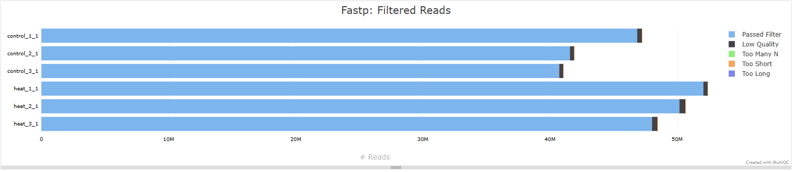

**Figure 2.** Per-sample read counts after `fastp` filtering. Nearly all
reads pass quality filters in every sample. Reads removed due to low quality,
excessive N content or length violations are negligible.

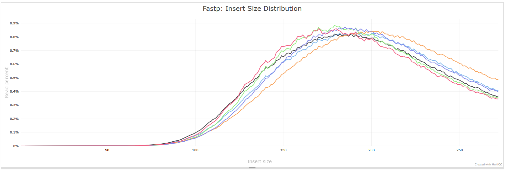

**Figure 3.** Fastp insert size distribution. Five samples cluster tightly
with a peak at ~170–190 bp. One sample (orange) shows a broader distribution
shifted toward larger insert sizes, indicating minor differences in library
fragmentation for that replicate.

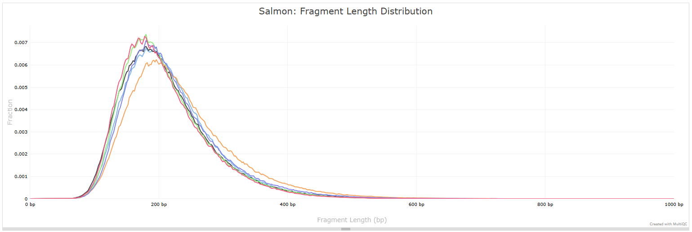

**Figure 4.** Salmon fragment length distribution inferred during
quasi-mapping. The same outlier sample (orange) shows a lower and flatter
peak compared to the other five samples. The agreement between fastp and
Salmon confirms this is a library-level characteristic rather than a mapping
artifact.

Overall, read quality is high and consistent across all six samples. Mapping
rates are uniform between conditions, GC content matches the expected
*S. cerevisiae* genomic composition, and filtering removes negligible reads.
One sample shows a slightly atypical fragment length distribution, but as
shown in the next section, this has no detectable effect on the analysis
after normalization.

### Sample Clustering

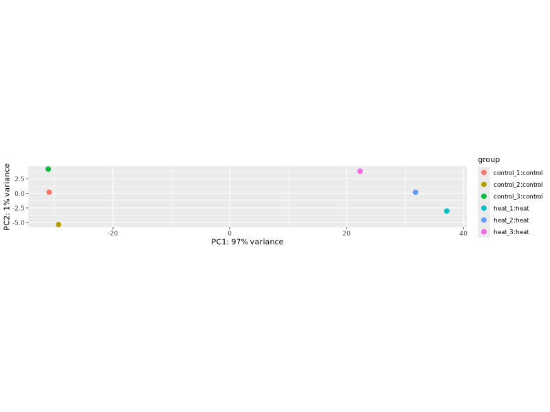

**Figure 5.** PCA of rlog-normalized expression values. PC1 (97% of
variance) completely separates heat-shocked from control samples with no
overlap.

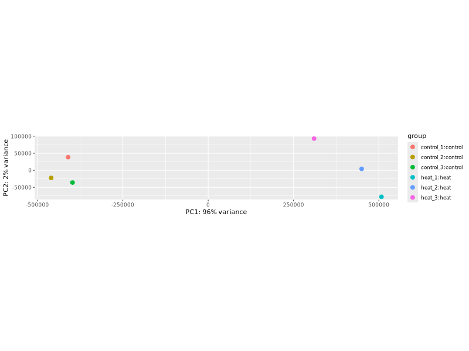

**Figure 6.** PCA of raw unnormalized counts. The same condition separation
is visible (PC1, 96% variance). The fragmentation outlier from Figures 3–4
shows a pronounced PC2 offset in the raw data that disappears after
normalization.

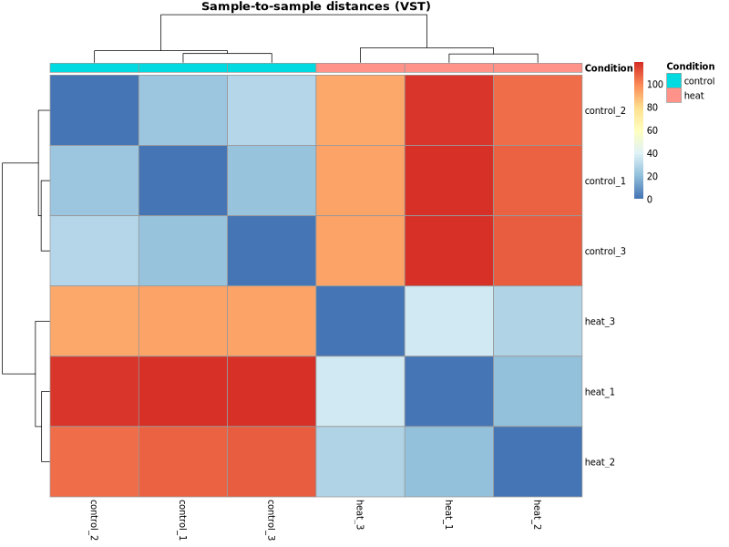

**Figure 7.** Sample-to-sample distance matrix (VST-transformed). Low 
distances (blue) within conditions and high distances (red) between conditions
confirm clean separation and good within-group reproducibility.

Both PCA and clustering show that condition (heat vs. control) is the
dominant source of variation in the dataset, with all replicates grouping
cleanly within their respective groups. There are no signs of batch effects
or sample swaps. The technical outlier identified in QC clusters correctly
with its condition group after normalization, confirming it does not need
to be excluded.

### Differential Expression

At the stringent threshold (padj ≤ 0.0005, |log₂FC| ≥ 1), 1,293 genes were
differentially expressed: 585 upregulated and 708 downregulated. Key
canonical ESR-induced genes were recovered with strong fold changes, including
HSP26 (log₂FC = 8.1), HSP12 (7.5), CTT1 (4.2), SSA4 (3.0), TPS1 (2.3) and
HSP104 (1.8). The repressed gene set was dominated by ribosomal protein genes
including RPL9A, RPS22A, RPS0A, RPL30 and RPL7A.

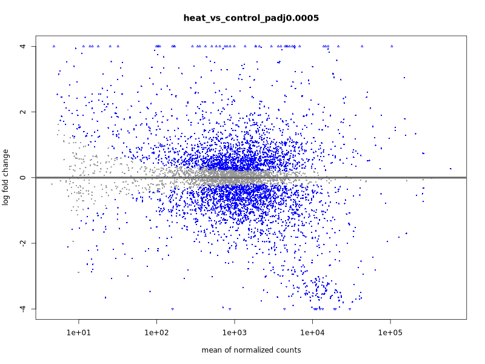

**Figure 8.** MA plot showing log₂ fold change versus mean normalized
expression. Significant DEGs are highlighted in blue. Triangles indicate
genes beyond the plot limits (|log₂FC| > 4). The symmetric distribution
around zero confirms no normalization bias.

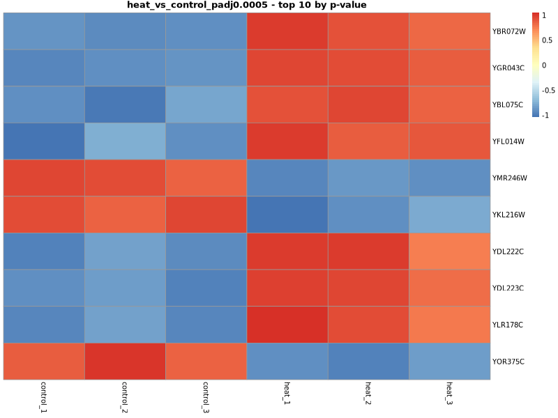

**Figure 9.** The 10 most statistically significant DEGs. Both strongly
induced (HSP26, HSP12) and strongly repressed (URA1) genes are represented,
reflecting the bidirectional nature of the heat shock response.

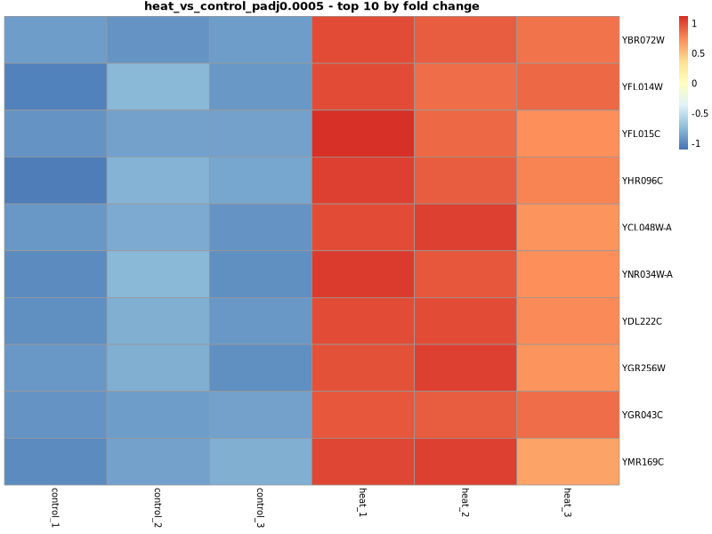

**Figure 10.** The 10 genes with the highest log₂ fold change. All are
strongly induced in heat samples, led by the chaperones HSP26 (log₂FC = 8.1)
and HSP12 (log₂FC = 7.5), with a consistent pattern across all three
replicates.

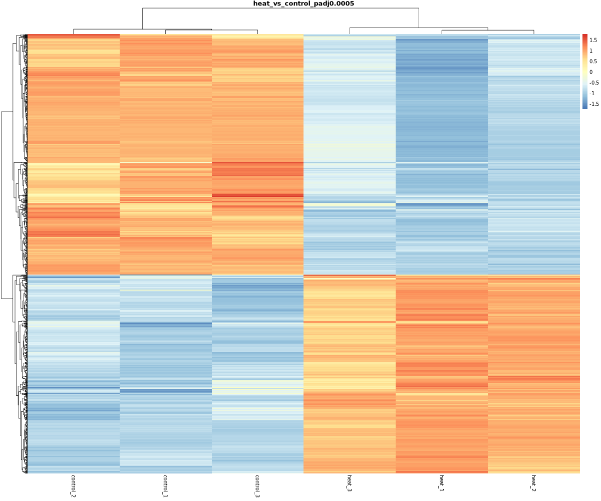

**Figure 11.** Heatmap of all 1,293 significant DEGs (row-scaled). Two
blocks are clearly visible: genes repressed by heat shock (upper, dominated
by ribosomal proteins) and genes induced by heat shock (lower, enriched for
chaperones and stress-protective functions).

The DE results are clean and strongly significant. The induced genes match
the expected heat shock signature from the literature, and the repressed
genes reflect the well-known shutdown of ribosome biogenesis and translation
during stress. The pattern is highly reproducible across all three replicates
in both conditions.

### GO Enrichment

GO enrichment was performed on all 1,293 DEGs combined, yielding 62
significant Biological Process terms at padj ≤ 0.0005.

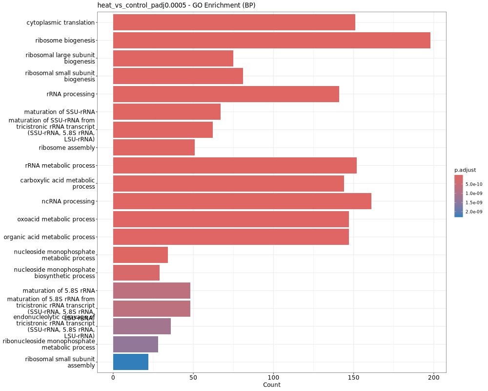

**Figure 12.** Top 20 enriched GO terms ordered by gene count. All top terms
relate to ribosome biogenesis and cytoplasmic translation.

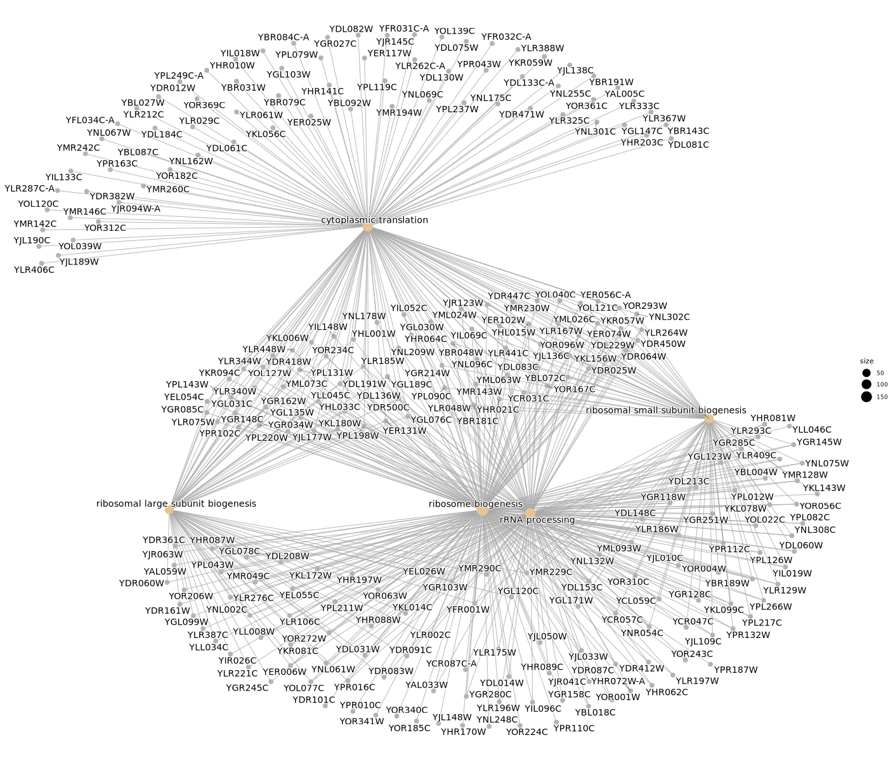

**Figure 13.** Gene-concept network of the top 5 enriched GO terms. The
large overlap between nodes reflects the coordinated nature of translational
repression during heat stress.

The enrichment is dominated by ribosome- and translation-related terms
(cytoplasmic translation padj = 3.6×10⁻⁶⁸, ribosome biogenesis
padj = 1.2×10⁻³⁰), driven by the 708 downregulated genes. This is expected:
the repressed side of the ESR is numerically larger and produces stronger
statistical signal. The induced side is still represented — trehalose
metabolic process (padj = 3.7×10⁻⁶) is the clearest induced-side term,
consistent with the role of trehalose in heat stress protection. A separate
enrichment of only the upregulated genes would recover chaperone and protein
folding terms more prominently, which is a straightforward extension of the
current pipeline.

## Interpretation
The results confirm the hypothesis. The heat shock response is the dominant
source of transcriptional variation (PC1, 97% of variance), and conditions
separate completely at every level of analysis.

The induced genes match the expected ESR biology: the top hits are canonical
chaperones (HSP26, HSP12, SSA4, HSP104, HSP78) alongside trehalose
biosynthesis genes (TPS1, TPS2, TSL1) and the cytosolic catalase CTT1 —
all well-established Gasch ESR targets reflecting the cell's response to
protein unfolding and oxidative damage under thermal stress.

The repressed genes are equally consistent: ribosomal protein genes dominate
the downregulated fraction, reflecting the well-known shutdown of growth and
biosynthesis during stress. Because the repressed set is numerically larger
(708 vs. 585 genes), it drives the GO enrichment results, where ribosome
biogenesis and cytoplasmic translation terms dominate. This is expected
behavior when enrichment is run on the combined DEG set; running it separately
on upregulated genes would surface chaperone and protein folding terms more
prominently.

The two padj thresholds (0.05 and 0.0005) produce qualitatively identical
enrichment profiles, confirming the signal is robust and not dependent on a
particular statistical cutoff.

Two limitations are worth noting. First, one heat replicate shows a slightly
atypical fragment length distribution, but it clusters correctly after
normalization and does not distort the results. Second, with n = 3 replicates
per group, statistical power is limited for genes with modest fold changes.
This analysis is best understood as a pipeline validation against a
well-characterized biological benchmark, not a primary discovery study.

Overall, the pipeline reliably detects, quantifies and functionally annotates
the *S. cerevisiae* heat shock response, reproducing the core ESR features
described by Gasch et al. (2000) from an independent RNA-seq dataset.

## References

Ewels P et al. (2016). MultiQC: Summarize analysis results for multiple 
tools and samples in a single report. Bioinformatics 32(19):3047–3048. 
doi:10.1093/bioinformatics/btw354

Gasch AP et al. (2000). Genomic expression programs in the response of yeast cells to environmental changes. Mol Biol Cell 11(12):4241–4257. 
doi:10.1091/mbc.11.12.4241

Love MI, Huber W, Anders S (2014). Moderated estimation of fold 
change and dispersion for RNA-seq data with DESeq2. Genome Biology 15:550. 
doi:10.1186/s13059-014-0550-8

Patro R et al. (2017). Salmon provides fast and bias-aware quantification 
of transcript expression. Nature Methods 14:417–419. 
doi:10.1038/nmeth.4197

Serrano-Quílez J et al. (2025). Transcriptional memory dampens heat shock responses in yeast: functional role of Mip6 and its interaction with Rpd3. G3 15(8):jkaf144. 
doi:10.1093/g3journal/jkaf144

Wu T et al. (2021). clusterProfiler 4.0: A universal enrichment tool for 
interpreting omics data. The Innovation 2(3):100141. 
doi:10.1016/j.xinn.2021.100141

## Acknowledgements

Computational analyses were performed on the LiSC HPC cluster at the
University of Vienna.